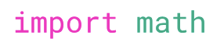

# 3.4 Math Operators & Math Library

## Success Criteria
- [x] I can use math operators in Python
- [x] I can distinguish between a unary operator and binary operator
- [x] I can import the math library and use math.sqrt() and math.pi() functions
- [x] I can use the built-in functions round() and abs()
- [x] I understand how the order of operations work in Python

## Math Operators

| Math Operator | Operation      | Example Expression | Example Code | Result |
| ------------- | -------------- | ------------------ | ------------ | ------ |
| `+`           | Addition       | 3 + 2              | `3 + 2`      | `5`    |
| `-`           | Subtraction    | 3 - 2              | `3 - 2`      | `1`    |
| `*`           | Multiplication | 3 x 2              | `3 * 2`      | `6`    |
| `/`           | Division       | 3 ÷ 2              | `3 / 2`      | `1.5`  |
| `//`          | Floor Division | N/A                | `3 // 2`     | `1`    |
|               | (always rounds down)  | N/A         | `11 // 4`    | `2`    | 
| `**`          | Power/Exponent | 3<sup>2</sup>      | `3 ** 2`     | `9`    |
| `%`           | Modulus        | N/A                | `3 % 2`      | `1`    |
|               | (remainder from division) | N/A     | `11 % 3`     | `2`    |
| `-`           | Negation       | -3                 | `-3`         | `-3`   |

### Binary vs. Unary Operators
- A <ins>**unary operator**</ins> is an operator that applies to *one* thing. Example: `negation` (`-3`)

- A <ins>**binary operator**</ins> is an operator that applies to things on both sides of the operator. Most math operators are considered binary operators (with the exception of `negation`)


### Math and Data Types
-----
#### Addition, Subtraction, Multiplication, Floor Division
| Operation                             | Output Type | Example     | Result |
| ------------------------------------- | ----------- | ----------- | ------ |
| float `+` or `-` or `*` or `//` float | float       | `3.0 + 4.0` | `7.0`  |
| int `+` or `-` or `*` or `//` int     | int         | `3 + 4`     | `7`    |
| float `+` or `-` or `*` or `//` int   | float       | `3.0 + 4`   | `7.0`  |

<span style="color:red">
<b>
NOTE: If there is a float in the calculation, the result is ALWAYS a <i>float</i>
</b>
</span>

#### Division
| Operation       | Output Type | Example      | Result |
| --------------- | ----------- | ------------ | ------ |
| float `/` float | float       | `10.0 / 2.0` | `5.0`  |
| int `/` int     | float       | `10 / 2`     | `5`    |
| float `/` int   | float       | `10.0 / 2`   | `5.0`  |

<span style="color:red">
<b>
NOTE: Division ALWAYS results in a <i>float</i>
</b>
</span>

## Order of Operations (Operator Precedence)
Just like in math, certain operators will have precedence over other operators. In math, we more commonly know it as order of operations. In Computer Science, you may hear the words `Operator Precedence`. This is a set of rules that determines when different pieces of an expression get evaluated.

#### Order of Operations
| Order                                | Example                   |
| ------------------------------------ | ------------------------- |
| 1. Brackets                          | `(...)`                   |
| 2. Exponent                          | `x ** y`                  |
| 3. Negation                          | `-x`                      |
| 4. Multiplication, Division, Modulus | `x * y`, `x / y`, `x % y` |
| 5. Addition, Subtraction             | `x + y`, `x - y`          |

<span style="color:red">
<b>
NOTE: Order will always go from left to right for operations with the same precedence
</b>
</span>

<br>

<ins>```EXAMPLE:```</ins>```Let's work out the order of operations for the following expression```
```
  (6 + (3 - 2 * 2)) ** 2
= (6 + (3 - 4)) ** 2
= (6 + -1) ** 2
= 5 ** 2
= 25 
``` 

## Math Library
What if there are more mathematical operations you want to use like squareroot or pi?
We need to access these functions through something called the `Math library`.

In order to use the functions in the math library, we need to `import` it:



<span style="color:red">
<b>
NOTE: Any library that you import <ins>MUST BE DONE AT THE VERY BEGINNING</ins> of your program, right after your program header
</b>
</span>

There are many functions that we can use from the math library, but many of them use math concepts that you have not learned yet. So for now, we will only need to use these two:

| Math function  | What does it do?                                            | Example          | Result             | Output Type |
| -------------- | ----------------------------------------------------------- | ---------------- | ------------------ | ----------- |
| `math.sqrt(#)` | Takes the squareroot of an `int` or `float` inside the `()` | `math.sqrt(9)`   | `3.0`              | `float`     |
|                |                                                             | `math.sqrt(9.0)` | `3.0`              | `float`     |
|                |                                                             | `math.sqrt(5)`   | `2.23606797749979` | `float`     |
|                |                                                             | `math.sqrt(5.0)` | `2.23606797749979` | `float`     |
| `math.pi()`    | Returns the value of pi. There is no value in the brackets  | `math.pi()`      | `3.141592653589793`| `float`     |

## Other Useful Functions (Built into Python)
| Built-in Function                   | What does it do?                                            | Example            | Result |
| ----------------------------------- | ----------------------------------------------------------- | ------------------ | ------ |
| `round(<number>)`                   | Rounds a `<number>` to the nearest whole float number       | `round(3.837)`     | `3.0`  |
| `round(<number>, <decimal_places>)` | Rounds a `<number>` to the number of `<decimal_places>`     | `round(3.837, 2)`  | `3.84` |
| `abs(<number>)`                     | Takes the absolute value of a `<number>` (make it positive) | `abs(-30)`         | `30`   |